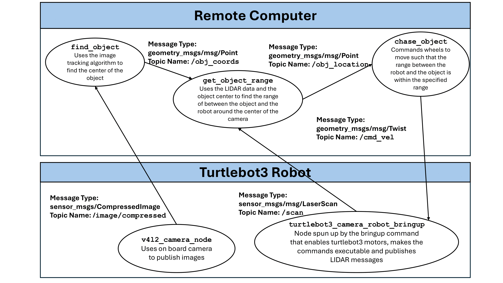

# IRR Lab 2
This ROS2 package is an orange-ball following program. Run
1. `ros2 launch turtlebot3_bringup camera_robot.launch.py` Launch turtlebot stack (includes camera)
2. `ros2 run find_object_py subscriber` Run CV node which subscribes to the camera image and publishes the object's normed location relative to center of the image
3. `ros2 run rotate_robot rotate_robot_pubsub` Run control node which subscribes to the object location and publishes a velocity command

Ideally, we can run these all with the launch file:
`ros2 launch find_object_py follow_object.py`

## ROS Diagram

